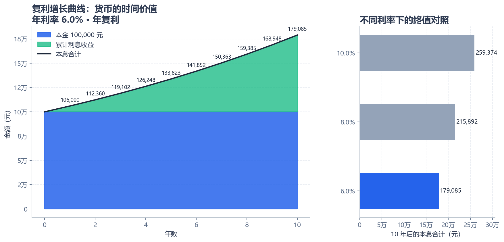
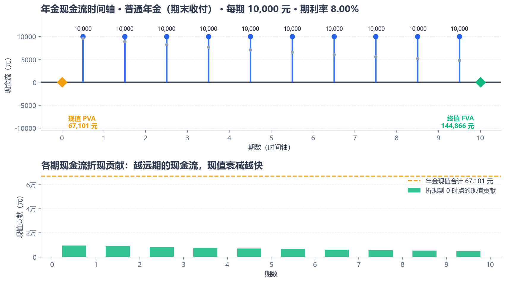
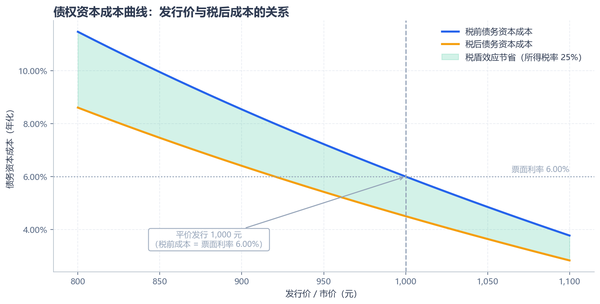
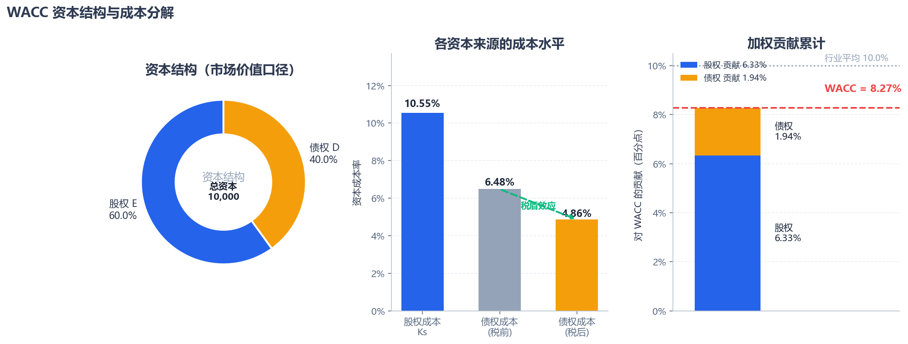
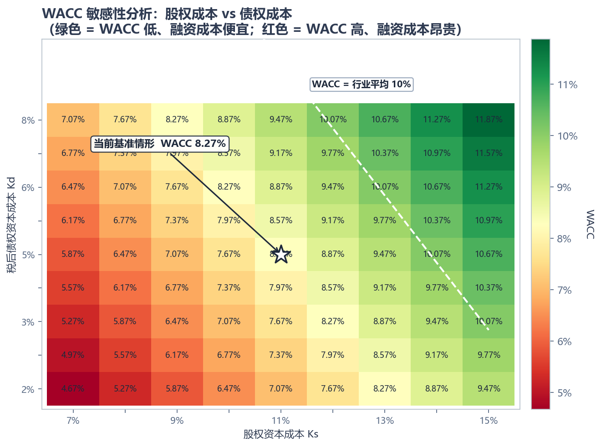
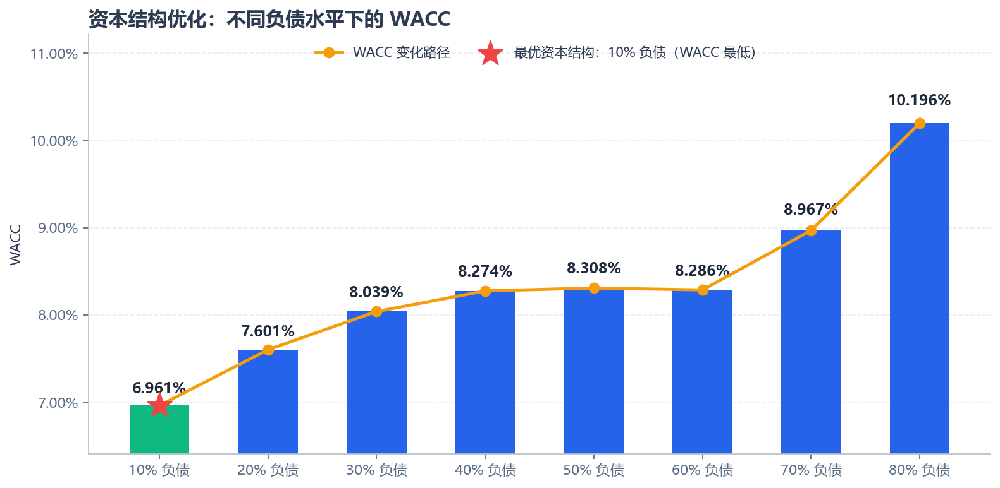
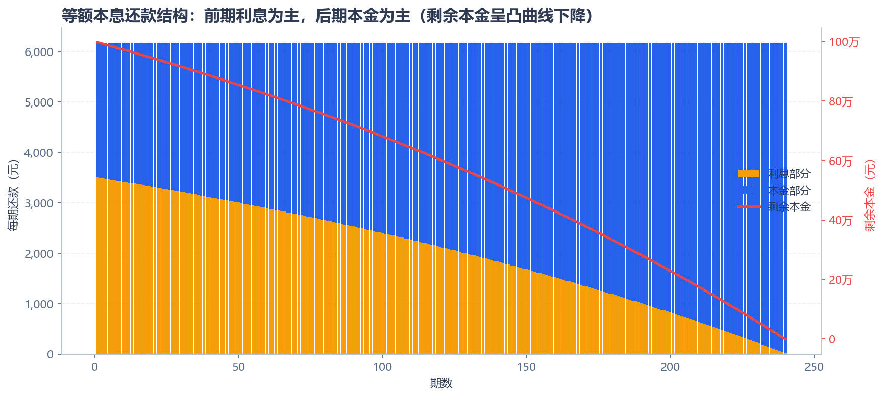
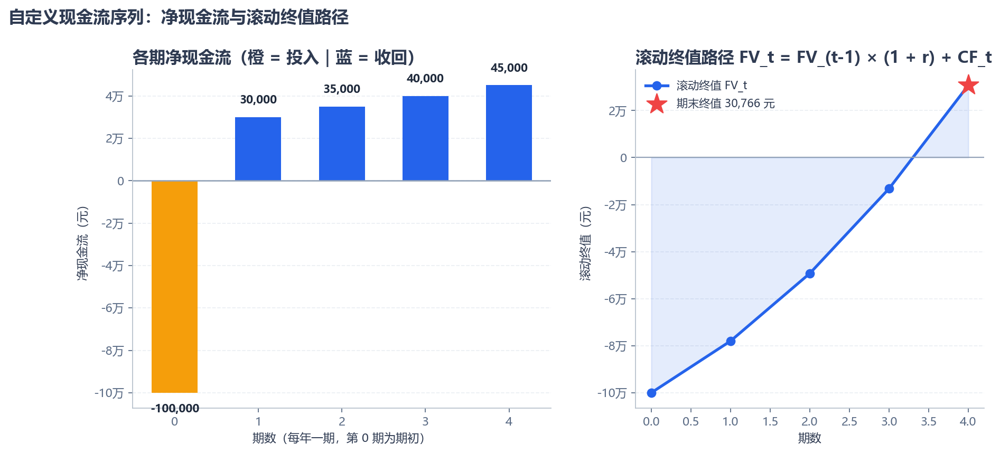
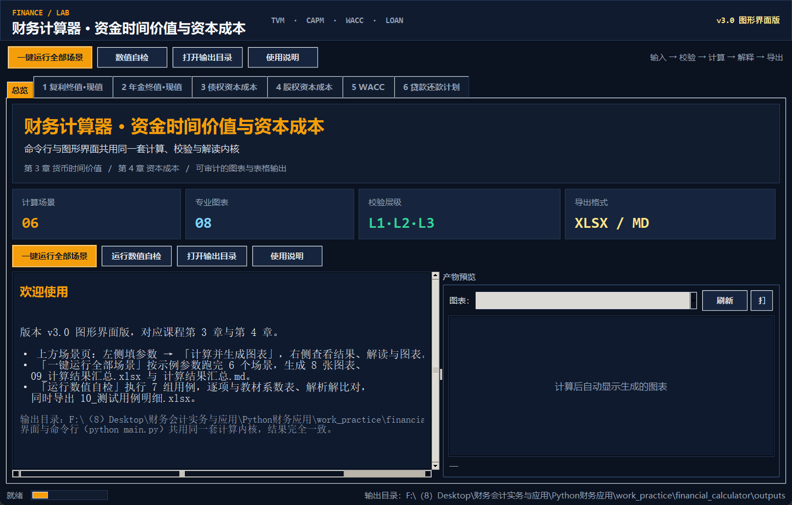
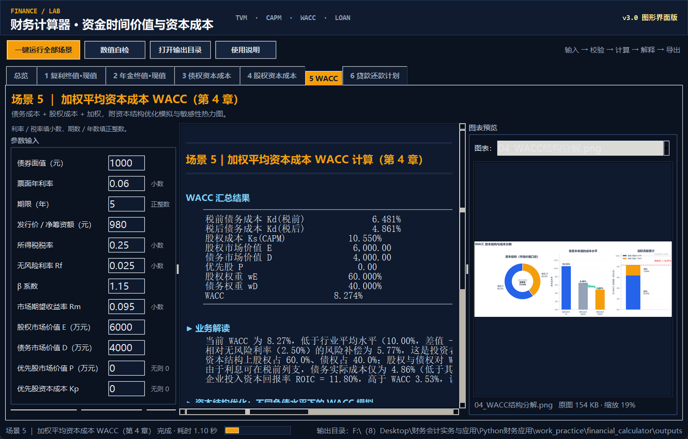

# 货币时间价值与资本成本自动化计算器
## 开发报告（Python + AI 辅助）

---

## 目录

- [一、项目概述](#一项目概述)
- [二、课程知识点对应关系](#二课程知识点对应关系)
- [三、系统架构与功能模块](#三系统架构与功能模块)
- [四、核心算法实现](#四核心算法实现)
- [五、AI 辅助功能设计](#五ai-辅助功能设计)
- [六、可视化输出](#六可视化输出)
- [七、测试用例与结果验证](#七测试用例与结果验证)
- [八、图形界面实现](#八图形界面实现)
- [九、项目总结与改进方向](#九项目总结与改进方向)
- [附录：运行说明](#附录运行说明)

---

## 一、项目概述

### 1.1 项目背景

企业在进行投融资决策时，需要快速、准确地计算复利终值/现值、年金终值/现值，以及债权、股权和加权资本成本。传统的 Excel 方式存在三个突出问题：

1. **易出错**：手工录入公式时容易混淆"利率小数与百分数"、"期间利率与年利率"等口径，且单元格引用错误难以被察觉；
2. **可复用性差**：每次更换场景都要重新搭建表格结构，无法参数化批量计算；
3. **解释性弱**：算出数字后，缺乏对结果业务含义的自动解读，决策者需要自行判断。

本项目通过 **Python + AI 辅助** 开发一套自动化计算器，实现**一键式批量计算与可视化展示**，并把"参数校验"和"结果解读"两个环节交给 AI 辅助生成逻辑，形成"输入—计算—解释—决策"的完整闭环。

### 1.2 项目目标

| 目标 | 具体要求 | 实现情况 |
| --- | --- | --- |
| 功能完整 | 覆盖复利、年金、永续年金、自定义现金流、债务成本、股权成本、WACC | ✅ 19 个核心计算函数（`core.__all__` 共 20 项，另含 1 个异常类） |
| 交互友好 | 命令行菜单 + 图形界面，用户选择场景并输入参数 | ✅ 7 个业务场景（CLI 菜单 1~8 项）+ tkinter 图形界面 |
| 智能校验 | 自动拦截非法输入并给出通俗提示 | ✅ 三层校验机制，13 类参数规则 |
| 解释充分 | 计算结果附带业务场景解读 | ✅ 4 类解释引擎（TVM/债务/股权/WACC）+ 口径声明 |
| 可视化 | 曲线、时间轴、热力图、结果表格 | ✅ 8 张专业数据图表 + 2 张界面截图 + Excel 导出 |
| 可验证 | 3 个以上测试案例，结果可核对 | ✅ 8 组用例、51 项数值断言全部通过 + 11 项边界回归 |

### 1.3 技术栈

| 组件 | 版本（实测） | 用途 |
| --- | --- | --- |
| Python | 3.9.13 | 主开发语言 |
| numpy | 2.0.2 | 数值计算、数组运算 |
| pandas | 2.3.3 | 数据表构建、Excel 导出 |
| matplotlib | 3.9.4 | 全部可视化图表 |
| openpyxl | 3.1.5 | Excel 读写的底层引擎 |
| Pillow | 11.3.0 | 图形界面中的图片缩放与截图 |
| tkinter | 8.6 | 图形界面框架（随 Python 官方安装包自带） |

> 上表版本为本机实际运行通过的环境；`requirements.txt` 采用"下限 + 下一主版本上限"的区间写法（如 `pandas>=2.0,<3`），既避免在仅有较新版本的机器上装不上，也规避跨主版本的破坏性变更。
>
> **AI 辅助的定位**：本项目中的"AI 辅助"体现为**由 AI 生成参数校验规则库、错误提示文案模板、以及结果业务解读逻辑**。这些不是简单的静态文本，而是带有分支判断（如 WACC 与行业均值比较后自动选择措辞）的解释引擎，其设计模式与 AI 生成内容的工程化落地方式一致。

---

## 二、课程知识点对应关系

### 2.1 第 3 章：货币时间价值

| 知识点 | 公式 | 代码实现 | 对应函数 |
| --- | --- | --- | --- |
| 复利终值 | $FV = PV \times (1 + r/m)^{n \cdot m}$ | `core.fv_compound()` | 支持年/季/月/日多频率计息 |
| 复利现值 | $PV = FV / (1 + r/m)^{n \cdot m}$ | `core.pv_compound()` | 同上 |
| 实际年利率 | $EAR = (1 + r/m)^m - 1$ | `core.effective_annual_rate()` | 量化计息频率效应 |
| 普通年金终值 | $FVA = PMT \times \frac{(1+r)^n - 1}{r}$ | `core.fva_ordinary()` | 每期期末收付 |
| 普通年金现值 | $PVA = PMT \times \frac{1 - (1+r)^{-n}}{r}$ | `core.pva_ordinary()` | 房贷、养老金的定价基础 |
| 预付年金终值 | $FVA_{due} = FVA \times (1+r)$ | `core.fva_due()` | 期初收付，多计一期利息 |
| 预付年金现值 | $PVA_{due} = PVA \times (1+r)$ | `core.pva_due()` | 先付型租金、保费 |
| 永续年金现值 | $PVP = PMT / (r - g)$ | `core.pv_perpetuity()` | 含戈登增长模型 |
| 滚动终值（不规则现金流） | $FV_t = FV_{t-1}(1+r) + CF_t$ | `core.fv_from_schedule()` | 自定义现金流序列的期末积累 |
| 净现值 | $NPV = \sum_{t=0}^{n} \frac{CF_t}{(1+r)^t}$ | `core.npv()` | 自定义现金流序列的决策依据 |
| 内部收益率 | 求 $r$ 使 $NPV(r) = 0$ | `core.irr()` | 牛顿迭代 + 二分法兜底 |
| 贷款还款计划 | $PMT = P \cdot \frac{r}{1 - (1+r)^{-n}}$ | `core.amortization_schedule()` | 年金现值公式逆向应用 |

### 2.2 第 4 章：资本成本

| 知识点 | 公式 | 代码实现 | 关键设计 |
| --- | --- | --- | --- |
| 债权资本成本（精确法） | $\text{Price} = \sum \frac{C}{(1+k)^t} + \frac{F}{(1+k)^N}$ | `core.cost_of_debt()` | 自实现牛顿迭代求 YTM；支持付息频率 `freq` 与筹资费率 `f` |
| 债权资本成本（近似法） | $K_d \approx \frac{F \cdot c + (F-P)/N}{(F+P)/2}$ | `core.cost_of_debt_approx()` | 与精确法互验 |
| **净筹资额（发行费用）** | $P_{net} = P \times (1 - f)$ | `core.cost_of_debt(flotation_cost=…)` | 与国内教材"发行价 ×(1−f)"口径对齐 |
| **税盾效应** | $K_{d,after} = K_{d,before} \times (1-T)$ | `core.cost_of_debt_after_tax()` | 债务融资的核心优势；三种税后口径并列输出 |
| 股权资本成本（CAPM） | $K_s = R_f + \beta(R_m - R_f) + SP$ | `core.capm_required_return()` | 含规模溢价扩展项 |
| 股权资本成本（DDM） | $K_s = D_1/P_0 + g$ | `core.cost_of_equity_ddm()` | 交叉验证 CAPM；支持筹资费率 |
| **加权平均资本成本** | $WACC = \frac{E}{V}K_s + \frac{D}{V}K_{d,after} + \frac{P}{V}K_p$ | `core.wacc()` | 债务须用**税后**成本；三类资本来源 |

### 2.3 债券定价（辅助工具）

作为教材例题的校验手段，项目还实现了现金流贴现法定价：

$$\text{Bond Price} = \underbrace{PMT \times \frac{1-(1+r)^{-N}}{r}}_{\text{票息年金现值}} + \underbrace{\frac{F}{(1+r)^N}}_{\text{面值复利现值}}$$

当票面利率 = 市场利率时理论价格恰等于面值（平价发行），该性质被用作模型的**自洽性校验**（见测试用例 3）。

---

## 三、系统架构与功能模块

### 3.1 模块划分

项目采用"**计算层 / 校验层 / 表现层**"三层解耦架构：

```
financial_calculator/
├── core.py                       【计算层】19 个纯函数，无 I/O，可独立单元测试
├── validators.py                 【校验层】三层校验规则库（13 类参数）+ 4 类业务解释引擎
├── visualize.py                  【表现层】7 个 plot_* 图表生成函数（产出 8 张数据图）
├── report.py                     【表现层】Excel / Markdown / 用例簿导出
├── main.py                       【交互层】命令行菜单 + 7 大场景编排
├── gui.py                        【交互层】tkinter 图形界面（7 个场景表单页）
├── financial_calculator_gui.pyw  【启动器】双击即可打开图形界面（pythonw 无控制台）
├── test_cases.py                 【测试层】8 组用例 + 51 项数值断言 + 11 项边界回归
├── legacy/                       【历史版本】早期单文件版，仅作参考，不参与运行
├── docs/                         【文档】开发报告、GUI 说明、报告插图与数据附件
│   ├── figures/                  （报告插图 10 张）
│   └── excel/                    （报告数据附件 3 份）
└── outputs/                      【运行产物】每次运行自动重建，不纳入版本管理
```

**分层设计的价值**：
- `core.py` 中的函数不依赖任何输入输出，可被 Web 服务、批处理脚本直接复用；
- `validators.py` 与 `visualize.py` 只依赖 `core.py` 的输出字典，替换 UI（CLI ⇄ GUI）无需改动计算逻辑——本项目在 CLI 之外新增图形界面时，`core.py` 一行未动即是佐证；
- 双引擎互验（精确法与近似法、CAPM 与 DDM、年金的"逐期滚动终值"与"整体折现净现值"）使结果具备**内在自检能力**。

### 3.2 功能菜单

```
   ┌──────────────────────────────────────────────────────────┐
   │       货币时间价值与资本成本计算器  v1.0                │
   │       Time Value of Money & Cost of Capital Calculator   │
   ├──────────────────────────────────────────────────────────┤
   │  第 3 章 货币时间价值                                    │
   │    1. 复利终值 / 现值计算                                │
   │    2. 年金终值 / 现值计算（普通年金 / 预付年金）          │
   │    6. 贷款还款计划（等额本息，年金公式应用）              │
   │    7. 永续年金现值 / 自定义现金流序列                     │
   │  第 4 章 资本成本                                        │
   │    3. 债权资本成本（含税盾效应）                          │
   │    4. 股权资本成本（CAPM / DDM）                          │
   │    5. 加权平均资本成本 WACC（含敏感性分析）               │
   │  其他                                                    │
   │    8. 一键运行全部示例场景（生成全部图表与 Excel）        │
   │    0. 退出程序                                            │
   └──────────────────────────────────────────────────────────┘
```

> 菜单边框按**亚洲字符显示宽度**（`unicodedata.east_asian_width`）自动对齐，中英文混排时右边框不会错位。

### 3.3 运行方式

| 命令 | 作用 |
| --- | --- |
| `python main.py` | 交互式菜单模式，逐步引导输入参数 |
| `python main.py --demo` | 一键运行全部示例场景，批量生成 8 张数据图表 + 3 份 Excel |
| `python main.py --scene 7` | 直接运行指定编号场景（1~7，非交互，适合批量调度） |
| `python gui.py` | 打开图形界面（等价于双击 `financial_calculator_gui.pyw`） |
| `python gui.py --check` | 环境自检：tkinter / Pillow / 中文字体可用性 |
| `python test_cases.py` | 执行 8 组测试用例，输出 51 项数值断言结果与用例明细簿 |

---

## 四、核心算法实现

### 4.1 年金公式的零利率退化处理

教材公式 $PVA = PMT \times \frac{1-(1+r)^{-n}}{r}$ 在 $r=0$ 时出现 $\frac{0}{0}$ 的不定式。程序中显式处理该边界：

```python
if abs(r) < 1e-12:                      # 零利率退化，避免除零
    return float(pmt) * n
```

这保证了"零利率下年金现值 = 每期金额 × 期数"这一常识性结论，也是很多手工 Excel 表格会产生 `#DIV/0!` 错误的典型位置。

### 4.2 债务资本成本：自实现牛顿迭代求解 YTM

债券资本成本本质上是求解使 NPV = 0 的折现率（即内部收益率 IRR）。项目**未使用 numpy_financial 等外部依赖**，而是自实现牛顿-拉夫逊迭代法：

$$r_{k+1} = r_k - \frac{f(r_k)}{f'(r_k)}, \quad f(r) = \sum_{t=0}^{N} \frac{CF_t}{(1+r)^t}, \quad f'(r) = \sum_{t=0}^{N} \frac{-t \cdot CF_t}{(1+r)^{t+1}}$$

**稳健性设计**：牛顿法在导数接近零时可能发散，程序在迭代 200 次未收敛后自动退化为 $[-0.9999,\ 10]$ 区间上的**二分法兜底**，确保债券 YTM 这类问题总能得到数值解。收敛精度实测达 $10^{-13}$ 量级：

```python
# 验证：按求解出的 7.226870% 折现，NPV 应为 0
>>> core.npv(0.07226870231547733, [-950, 60, 60, 60, 60, 1060])
-5.68e-13   ✅ 精度达标
```

### 4.3 期间利率与年化利率的口径转换

债券按半年付息时，IRR 求得的是**期间（半年）利率**，需转换为年化有效利率才能进入 WACC：

$$k_{annual} = (1 + k_{period})^{freq} - 1$$

这是实务中最易出错的口径之一（常见错误是简单乘 2，忽略了年内复利）。程序通过 `freq` 参数统一管理，并在计算结果中**并列输出三种税后口径**，把口径差异摆在明面上：

| 口径 | 公式 | 定位 |
| --- | --- | --- |
| **主口径**（年化有效利率） | $EAR \times (1-T)$ | 进入 WACC 的推荐口径；与 CAPM 的 $K_s$ 同为期初—期末复利年化量，可直接加权 |
| 严格口径（逐期税盾） | $(1 + k_{period}(1-T))^{m} - 1$ | 假设每期利息的抵税收益立即再投资，理论最严谨 |
| 教材简化 | 名义年利率 $\times (1-T)$ | 与国内教材例题写法一致，便于对答案 |

这三种口径之间的差异可以被**精确地写成等式**，而不是停留在"略有差别"的定性描述。以面值 1,000、票面 6%、5 年期、发行价 950、半年付息（$m = 2$）、$T = 25\%$ 为例：

```
每期（半年）利率 k = 3.604374%
税前年化有效利率 EAR = (1+k)^2 − 1 = 7.338663%
若误用「简单 ×2」     = 2k = 7.208748%

恒等式①：EAR − 2k ≡ k²
  7.338663% − 7.208748% = 0.129915% = k² = 3.604374%²   ✅ 精确成立

三种税后口径：
  主口径   EAR×(1−T)           = 5.503997%
  严格口径 (1 + k(1−T))^2 − 1  = 5.479638%
  教材简化 2k×(1−T)            = 5.406561%

恒等式②：主口径 − 严格口径 ≡ k²·T·(1−T)
  5.503997% − 5.479638% = 0.024359% = k²×0.25×0.75     ✅ 精确成立
```

解读这两个恒等式即可看清口径问题的本质：

- **恒等式①** 说明"简单 ×2"错在哪里——它丢掉的正是 $k^2$ 这一项（本题低估 12.99 个基点）。$k$ 越大、付息越频繁，丢失的越多；当 $m = 1$ 时 $k^2$ 项消失，年化与简单相乘自然相等。
- **恒等式②** 说明主口径与严格口径的差额**必然非负且随税率呈倒 U 形**：$T \to 0$ 或 $T \to 1$ 时差异归零，$T = 50\%$ 时差异最大。因此两者在 $T = 25\%$ 时相差 2.44 个基点，属可接受的方法学差异；但若题目明确要求"逐期税盾"口径，则应取严格口径。

当 `freq = 1` 时，$k^2$ 项不存在，恒等式①退化为 $0 = 0$，三种税后口径完全相等——默认场景即属此情形，输出中可见三者同为 5.420%。测试用例 3 对这组恒等式做了逐项断言（容差 $10^{-12}$）。

### 4.4 筹资费率：与教材"净筹资额"口径对齐

国内教材的债务成本公式分母为"发行价 × (1 − f)"，而国际教材多用"发行价 − 筹资费用"。程序采用**净筹资额** $P_{net} = P \times (1 - f)$ 作为求 YTM 的现金流现值基准，与国内教材口径一致；`flotation_cost` 同时作用于精确法、近似法与 DDM 优先股/普通股成本。

实测效果（面值 1,000、票面 6%、5 年期、发行价 980，筹资费率由 0 提高到 2%）：

```
f = 0%   → 净筹资额 980.00  税前年化资本成本 6.481023%
f = 2%   → 净筹资额 960.40  税前年化资本成本 6.964900%
                              （上升 0.483877 个百分点）
```

筹资费率把实际可动用资金从 980.00 元压低到 960.40 元，企业真实资本成本随之上升约 0.48 个百分点——这正是"发行费用会抬高实际融资成本"的量化体现，也是实务中讨论"承销费率对融资决策影响"的起点。

### 4.5 自定义现金流：滚动终值与折现净现值的双路径互验

《实践要求》要求"支持自定义现金流参数"。场景 7 允许用户输入任意期数、任意金额（可正可负）的现金流序列（如 `-100000, 30000, 35000, 40000, 45000`），程序用**两条独立实现路径**给出结果：

| 方法 | 递推/求和式 | 回答的问题 | 实现函数 |
| --- | --- | --- | --- |
| 滚动终值法 | $FV_t = FV_{t-1}(1+r) + CF_t$ | 各期现金流按 $r$ 再投资，期末能积累多少 | `core.fv_from_schedule()` |
| 折现净现值法 | $NPV = \sum \frac{CF_t}{(1+r)^t}$ | 整条序列在今天的净价值 | `core.npv()` |

两条路径必须满足恒等式 $FV = NPV \times (1+r)^{n-1}$。程序在输出中**内嵌该互验**，实测：

```
FV = 30,766.46 元；NPV = 22,614.27 元
互验：NPV × (1 + 8%)^(5−1) = 22,614.27 × 1.360489 = 30,766.46 元
与实际输出差异 0.000000 元（浮点误差）  ✅ 两条独立实现相互吻合
```

含正负现金流的投资型序列应以 **NPV 为决策依据**（NPV > 0 即收益率高于要求回报率），这一点在解读文案中被显式声明，避免误用滚动终值作投资判断。

### 4.6 资本结构模拟：U 型 WACC 曲线的构建

为演示第 4 章"资本结构决策"知识点，程序模拟不同负债水平下的 WACC。关键假设体现**MM 理论（有税）与财务困境成本的权衡**：

| 机制 | 建模方式 | 经济含义 |
| --- | --- | --- |
| 债权成本上升 | $K_d = K_{d0} \times (1 + 0.20\Delta w_d)$ | 债权人风险补偿 |
| 股权成本上升（更敏感） | $K_s = K_{s0} \times (1 + 1.05\Delta w_d)$ | 股东剩余索取权风险放大 |
| 高杠杆困境成本 | 负债率 > 55% 后加二次加速项 | 评级下调、再融资受限 |
| 税盾收益 | $K_{d,after} = K_{d,before}(1-T)$ | 利息税前扣除 |
| 优先股 | $w_P = P/V$；$WACC$ 含 $w_P K_p$ 项 | 三类资本来源的完整加权 |

模拟结果呈现出典型的 **U 型曲线**：WACC 在 40% 负债率处达到最低点 8.274%，超过 60% 后因财务风险加速上升而快速抬升（80% 负债时达 10.196%）。这一定量结果直观说明**"适度负债降低资本成本、过度负债反而抬高成本"**，为资本结构决策提供依据。

模拟的资本总额与负债率基准严格取自 WACC 汇总的同一口径（基准 $w_{D0} = D/V$），因此模拟曲线的起点与上文 WACC 汇总结果必然一致——实测当 E = 6000、D = 4000 时，基准 $w_{D0} = 40.0000\%$，与 WACC 汇总表输出的"债务权重 40.000%"完全吻合。

---

## 五、AI 辅助功能设计

### 5.1 参数校验逻辑（拦截非法输入）

校验采用**三层分级**设计，使"报错"本身成为一种教学输出：

| 层级 | 校验内容 | 处理方式 | 示例 |
| --- | --- | --- | --- |
| L1 类型层 | 是否为空、是否为数字 | 阻断 | 输入 `abc` → "【利率】必须为数字，当前输入为 “abc”。请输入形如 0.06 的数值" |
| L2 边界层 | 是否超出数学模型定义域 | 阻断 | 输入利率 `6`（本意 6%）→ "超出有效范围 [-0.99, 1.0]，请检查是否混淆了“小数”与“百分数”口径" |
| L3 合理性层 | 数值合法但反常识 | 警告不阻断 | β = 3.2 → "偏离常见区间 [0.3, 2.5]，建议核对数据来源" |

**校验规则库**（`validators.RULES`）覆盖 13 类参数，每类定义 `hard`（硬边界）与 `typical`（常见区间）双重区间：

```python
"rate": {
    "label": "利率",
    "hard": (-0.99, 1.00),        # 单期最高 100%，超过几乎必为口径错误
    "typical": (-0.05, 0.30),     # 常见区间：-5% ~ 30%
    "unit": "小数（0.05 表示 5%）",
}
```

**特殊校验逻辑**：

- **权重合计校验**：WACC 的 $w_E + w_D + w_P$ 必须等于 1，否则提示"是否遗漏优先股或少数股东权益"以及"权重是否统一用市场价值口径"——这是 WACC 计算中最常见的口径错误；
- **β 合理性校验**：β > 2.5 提示核对可比公司样本与回归窗口；β < 0.3 提示确认是否选到了弱周期行业样本；
- **期数整数性校验**：期数/年数必须为整数，因为它们在公式中代表完整计息周期数（`must_be_int` 标记）；
- **计算入口守卫**（`core._check_freq` / `_check_tax_rate` / `_check_flotation`）：即使绕过校验层直接调用计算函数，非法参数（如付息次数 0、税率 1.5、筹资费率 1.2）也会在计算前抛出中文 `FinanceError`，而不是产生 `ZeroDivisionError` 堆栈或无意义的数值。这一层是"最后一道防线"，由测试用例的边界回归组专门覆盖。

第三层（hint）产生的**口径提示**在交互模式下由 `_show_hints_once()` 去重后展示，避免同一提示反复刷屏。

### 5.2 错误提示文案设计

错误提示遵循"**错在哪里 + 为什么错 + 应如何修正**"三段式结构。例如利率口径混淆时的提示：

> **【利率】取值 6.0 超出有效范围 [-0.99, 1.0]（单位：小数（0.05 表示 5%））。该值会使财务模型失去数学或经济意义，请检查是否混淆了"小数"与"百分数"口径（例如 6% 应输入 0.06 而非 6）。**

这一设计显著降低了使用门槛——用户不需要理解财务模型，也能从提示中知道如何修正。

### 5.3 业务场景解释引擎

这是 AI 辅助功能的核心价值所在：把抽象数字翻译成决策语言。以 WACC 解释为例，解释引擎包含四个分析维度：

**维度一：绝对水平（与行业对比）**

解释引擎根据 WACC 与行业均值的差值**自动选择措辞分支**：

| 差值范围 | 措辞 | 追加建议 |
| --- | --- | --- |
| ≤ -2% | 明显低于 | 融资成本具有显著优势，安全边际较大 |
| -2% ~ -0.5% | 低于 | 融资成本处于较优水平，具有相对竞争力 |
| ±0.5% | 基本持平于 | 投资决策应更依赖项目的差异化优势 |
| 0.5% ~ 2% | 略高于 | 需通过提升回报率或优化资本结构弥补 |
| ≥ 2% | 明显高于 | 建议审视高 β 股权成本、财务风险与资本结构 |

实际输出示例：

> 当前 WACC 为 8.27%，低于行业平均水平（10.00%，差值 -1.73%），融资成本处于较优水平，在项目投资决策中具有相对竞争力。

**维度二：相对水平（与无风险利率的利差）**

> 相对无风险利率（2.50%）的风险补偿为 5.77%，这是投资者承担经营与财务风险所要求的额外回报，也是项目折现率的构成基础。

**维度三：结构成因（各来源贡献分解）**

> 资本结构上股权占 60.0%、债权占 40.0%；股权与债权对 WACC 的贡献分别为 6.33 与 1.94 个百分点。由于利息可在税前列支，债务实际成本仅为 4.86%（低于其税前水平），税盾效应在本次资本结构中降低了加权成本。

**维度四：价值创造（EVA 判断）**

若提供 ROIC，引擎自动判断企业是否创造经济增加值：

> 企业投入资本回报率 ROIC = 11.80%，高于 WACC 3.53%，说明当前经营正在创造经济增加值（EVA > 0），股东价值在增加。

反向情形（ROIC < WACC）时提示："经营回报未能覆盖全部资本成本（EVA < 0），长期看会侵蚀股东价值，需通过提价、降本或压缩低效资本占用改善。"

### 5.4 其他解释引擎

| 引擎 | 函数 | 解释内容 |
| --- | --- | --- |
| 时间价值解读 | `interpret_tvm()` | 口径声明 + 增长倍数/利息占比；**仅当年化口径时才输出 72 法则** |
| 债务成本解读 | `interpret_debt()` | 税盾节省量化、债务成本低于股权成本的双重原因、信用定价 |
| 股权成本解读 | `interpret_equity()` | CAPM 三分量拆解、β 高低的经济含义、多模型交叉验证提醒 |

`interpret_tvm()` 是本项目唯一涉及"事实性对错"的解释函数，其口径处理值得单独说明，因为"72 法则"只对**年化复利口径**成立：

| 输入口径 | 触发条件 | 输出行为 |
| --- | --- | --- |
| 年化口径，$r > 2\%$ | 默认调用（未传 `periods_per_year`） | 输出"约每 X 年翻一番（按 72 法则快速估算）" |
| 年化口径，$0 < r \le 2\%$ | 同上 | **不套用 72 法则**，改输出"72 法则在该区间误差较大（估算 X 年 vs 精确 Y 年）"，精确值由 $\ln 2 / \ln(1+r)$ 求得 |
| 年化口径，$r \le 0$ | 同上 | 输出"资金 N 年后缩水至本金的 X%，此情形下不存在翻番概念"——修复此前"每 720000 年翻一番"的荒谬输出 |
| 期利率口径 | 调用方传入 `periods_per_year=m` | 输出【期利率口径】声明：每期利率、期数、折合年数、折合年化有效利率（EAR），并明确"72 法则只适用于年化口径，此处不套用" |

---

## 六、可视化输出

项目共生成 **8 张专业数据图表**（另有 2 张图形界面截图，见第八章），全部使用 Matplotlib 绘制，配色统一、支持中文字体、可直接用于报告。

### 6.1 复利增长曲线（01）



**设计要点**：
- 左侧主图为**本金 + 利息堆积面积图**，蓝色为本金、绿色为累计利息，直观展示利息如何逐步超过本金；
- 自动标注**资金翻倍点**（红色圆点 + 箭头标注），配合 72 法则形成呼应；
- 右侧副图为**不同利率终值对照条形图**，当前利率高亮显示，展示利率对复利的放大作用。

### 6.2 年金现金流时间轴（02）



**设计要点**：
- 上图用 `stem` 图呈现每期现金流，**普通年金画在期中刻度、预付年金画在期初刻度**，从图形上直接区分两种年金；
- 灰色小点表示各期现金流"折现后的价值感"，视觉上呈现递减趋势；
- 下图展示**各期现金流折现贡献**，用柱形递减直观说明"远期现金流的现值衰减"，这是年金现值系数非线性的来源。

### 6.3 债权资本成本曲线（03）



**设计要点**：
- 横轴为发行价（800~1100 元），纵轴为债务资本成本；
- 两条曲线分别为税前与税后成本，**中间绿色填充区域即为税盾效应的量化体现**；
- 标注平价发行点（此时税前成本 = 票面利率 6%）与票面利率基准线，直观解释折价/溢价发行的成本含义；
- 曲线随调用方传入的付息次数与筹资费率同步变化（默认 `freq=1, f=0`）。

### 6.4 WACC 资本结构分解（04）



**三联图设计**：
- 左：资本结构环形图（股权/债权/优先股占比 + 总资本规模）；
- 中：各资本来源成本对比，并用**绿色箭头标注"税盾效应"带来的成本下降**（税前 6.48% → 税后 4.86%）；
- 右：加权贡献累计条形图，并标注 WACC 线与行业平均线，直观展示"谁在推高 WACC"。

### 6.5 WACC 敏感性分析热力图（05）



**设计要点**：
- 9×9 网格，横轴为股权成本 Ks、纵轴为税后债权成本 Kd，格内标注精确 WACC 数值；
- 配色采用 RdYlGn：**绿色 = WACC 低（融资便宜）、红色 = WACC 高（融资昂贵）**；
- 白色五角星标注**当前基准情形**，白色虚线为**行业平均 WACC 的等值线**；
- 实用价值：可直接回答"债务利率上浮多少个百分点会击穿既定资本成本目标"。

### 6.6 资本结构优化对比（06）



**设计要点**：
- 柱形为不同负债比例下的 WACC，橙色折线为变化路径，红色五角星标注**最优资本结构**；
- 呈现出教科书式的 **U 型曲线**：WACC 在 40% 负债率处最低（8.274%），超过 60% 后因财务风险加速上升；
- 直观支撑"适度负债降低资本成本、过度负债抬高成本"的资本结构理论。

### 6.7 贷款还款结构（08）



**设计要点**：
- 堆积柱形展示每期还款中本金与利息的构成（橙色为利息、蓝色为本金）；
- 红色曲线为剩余本金，呈凸曲线下降；
- 直观揭示等额本息"**前期还利息为主、后期还本金为主**"的特征。

### 6.8 自定义现金流序列（11）



**双栏图设计**：
- 左：净现金流柱形图，**正流入用红色、负流出用绿色**，第 0 期投资与后续各期回款一目了然，并在图内标注 NPV 与回收期概览；
- 右：**滚动终值路径**折线，展示 $FV_t$ 如何随期数累积，同时叠加"仅按折现再投资"的对照线，直观呈现复利再投资效应；
- 与前几类图相比，本图的自变量不是"假设参数"而是"真实现金流序列"，因此它是最贴近实务项目评价的一张图。

### 6.9 结果表格与 Excel 导出

除图表外，程序生成 3 份数据文件（均落在 `outputs/` 运行产物目录）：

| 文件 | 内容 |
| --- | --- |
| `07_贷款还款计划.xlsx` | 240 期完整还款计划表（期数/月供/利息/本金/剩余本金） |
| `09_计算结果汇总.xlsx` | 多 Sheet 汇总：场景总表 + WACC 明细 + 资本结构模拟 + 自定义现金流滚动路径 + 还款计划前 24 期 |
| `10_测试用例明细.xlsx` | 8 组测试用例的参数、计算过程、结论逐项明细，含边界回归组 |
| `计算结果汇总.md` | Markdown 格式汇总报告，可直接粘贴进文档（每次运行自动重建） |

---

## 七、测试用例与结果验证

项目设计了 **6 组业务场景测试用例 + 1 组校验测试 + 1 组边界回归**，全部采用**数值断言**方式验证（与教材系数表、解析解逐项比对），共 **51 项断言**，运行结果全部 PASS。

### 7.1 测试用例总览

| 序号 | 用例名称 | 覆盖知识点 | 关键验证点 | 结果 |
| --- | --- | --- | --- | --- |
| 1 | 个人储蓄复利增值 | 复利终值/现值、EAR | 计息频率效应 | ✅ PASS |
| 2 | 教育金定投 | 年金终值/现值 | 与教材系数表比对 | ✅ PASS |
| 3 | 企业债券资本成本 | 债务成本、税盾、YTM | 双引擎互验 + 债券定价自洽 + 半年付息与筹资费率 | ✅ PASS |
| 4 | 上市公司股权成本 | CAPM、DDM | 双模型交叉验证 | ✅ PASS |
| 5 | 某公司 WACC | 三大资本来源加权 | 贡献分解可加性 | ✅ PASS |
| 6 | 房贷还款计划 | 等额本息、年金逆向 | 现值逆向校验等于本金 | ✅ PASS |
| 附加 A | 参数校验测试 | AI 辅助校验 | 异常输入识别 | ✅ PASS |
| 附加 B | **边界回归测试** | 计算入口守卫 | 11 项非法/极端输入均以中文错误收场 | ✅ PASS |

### 7.2 关键测试结果

#### 用例 2：年金系数与教材附表比对

这是最严格的知识点校验——计算结果直接与教材附录的"年金现值系数表""年金终值系数表"比对：

```
(P/A, 5%, 10) = 7.721735   教材附表 7.7217   ✅ 一致
(F/A, 5%, 10) = 12.577893  教材附表 12.5779  ✅ 一致
```

#### 用例 3：债务成本双引擎互验

```
YTM 精确法（牛顿迭代）  Kd(税前) = 7.2269%
近似公式法（教材公式）  Kd(税前) = 7.1795%
两法差异                 0.0474 个百分点      ✅ 互为验证
```

同时验证债券定价模型自洽性：以票面利率 6% 折现时理论价格恰为面值 1,000.00 元，印证"票面利率 = 市场利率时平价发行"的结论。

**补充验证：半年付息与筹资费率**（本次新增 9 项断言）——把"期间利率 vs 年化利率"的口径问题用精确等式钉死：

```
freq = 2 时：每期利率 k = 0.03604374
  税前年化 EAR                    = 0.07338663
  恒等式① EAR − 2k ≡ k²            = 0.00129915   ✅
  主口径  EAR×(1−T)              = 0.05503997
  严格口径 (1+k(1−T))^2 − 1      = 0.05479638
  教材简化 2k×(1−T)              = 0.05406561
  恒等式② 主口径 − 严格口径 ≡ k²T(1−T) = 0.00024359   ✅
f = 2% 时（净筹资额 960.40）：税前年化资本成本 = 0.06964900   ✅
```

#### 用例 5：WACC 贡献分解可加性

```
WACC = 60.00% × 10.5500% + 40.00% × 4.8608% = 8.2743%
分解校验：股权贡献 6.3300 + 债权贡献 1.9443 = 8.2743  ✅ 完全可加
```

#### 用例 6：年金公式逆向校验

```
月供 PMT = 6,165.7074 元
逆向：把月供按 0.35% 月利率折现 240 期 = 1,000,000.000000 元
与贷款本金差异 < 0.000001 元                      ✅ 精确闭环
```

这一校验的意义在于证明"房贷的本质就是本金 = 各期还款的年金现值"，同时验证了 `amortization_schedule()` 与 `pva_ordinary()` 两个函数的内在一致性。

#### 附加测试 A：异常输入识别

| 测试情形 | 判定 | 提示摘要 |
| --- | --- | --- |
| 利率填成百分数（6 而非 0.06） | 拦截 ERROR | 超出有效范围，请检查是否混淆小数与百分数口径 |
| 利率为负数（-0.5） | 警告 WARN | 偏离常见业务区间，数值可计算但较为极端 |
| 期数为小数（3.5） | 拦截 ERROR | 必须为整数，期数代表完整计息周期数 |
| 期数为 0 | 拦截 ERROR | 超出有效范围 [1, 1200] |
| β 为极端值（3.2） | 警告 WARN | 偏离常见区间 [0.3, 2.5]，建议核对数据来源 |
| 所得税率为 1.2 | 拦截 ERROR | 超出有效范围 [0.0, 0.99] |
| 金额为空 / 为文本 | 拦截 ERROR | 不能为空 / 必须为数字 |
| WACC 权重合计 0.95 | 拦截 ERROR | 应等于 1，检查是否遗漏优先股或口径不一致 |

**结果**：全部异常输入被正确识别，无漏检。

#### 附加测试 B：边界回归（本次新增）

针对"绕过校验层直接调用计算函数"这一最危险的路径，用 11 项断言逐一验证**必须抛中文 `FinanceError`**，且不允许出现"静默返回错误结果"：

| 输入 | 期望行为 | 实测 |
| --- | --- | --- |
| 计息次数 m = 0 / −1 / 1.5 | 抛错 | ✅ "计息次数必须为不小于 1 的整数…" |
| 所得税税率 = 1.5 / −0.1 | 抛错 | ✅ "所得税税率须在 [0, 1) 区间内…" |
| 筹资费率 = 1.2 | 抛错 | ✅ "筹资费率须在 [0, 1) 区间内…" |
| WACC 三类资本金额全为 0 | 抛错 | ✅ "资本总额（股权+债权+优先股）必须大于 0。" |
| **场景 5 资本金额全为 0** | 抛错 | ✅ 修复前为 `ZeroDivisionError` 堆栈 |
| 永续年金 g ≥ r | 抛错 | ✅ "折现率 r 必须大于增长率 g，否则现值不收敛…" |
| 还款计划 freq = 0 | 抛错 | ✅ "每年还款次数必须为不小于 1 的整数…" |
| 自定义现金流仅 1 期 | 抛错 | ✅ "现金流序列至少需要 2 期（含第 0 期）…" |

另含 2 项**解读口径**断言（不抛异常，但文案必须是正确口径）：

```
✔ 负利率解读不再输出荒谬的翻番年数
  → "年化利率为负（-3.00%），资金 10 年后缩水至本金的 73.7%…"
✔ 期利率口径明确声明并给出折合年化利率
  → "口径声明：以下按【期利率口径】解读——每期利率 8.0000%…"
```

**结论**：全部边界输入均以中文 `FinanceError` 或口径声明收场，不再出现 `ZeroDivisionError` 堆栈，也不存在"静默返回错误结果"的情形，符合"非法输入在计算前被拦截"的设计承诺。

### 7.3 完整运行输出（节选）

以场景 5（WACC 计算）与场景 7（自定义现金流）为例，程序的实际输出：

```
══════════════════════════════════════════════════════════════
  场景 5 | 加权平均资本成本 WACC 计算（第 4 章）
══════════════════════════════════════════════════════════════

    WACC 汇总结果
    ───────────────────────────────────────
    税前债务成本 Kd(税前)              6.481%
    税后债务成本 Kd(税后)              4.861%
    股权成本 Ks(CAPM)             10.550%
    优先股成本 Kp                   0.000%
    股权市场价值 E                 6,000.00
    债务市场价值 D                 4,000.00
    优先股 P                        0.00
    股权权重 wE                   60.000%
    债务权重 wD                   40.000%
    优先股权重 wP                   0.000%
    WACC                       8.274%
    ───────────────────────────────────────

▶ 业务解读
    当前 WACC 为 8.27%，低于行业平均水平（10.00%，差值 -1.73%），
    融资成本处于较优水平，在项目投资决策中具有相对竞争力。
    相对无风险利率（2.50%）的风险补偿为 5.77%，这是投资者承担经营与
    财务风险所要求的额外回报，也是项目折现率的构成基础。
    资本结构上股权占 60.0%、债权占 40.0%；股权与债权对 WACC 的贡献
    分别为 6.33 与 1.94 个百分点。
    由于利息可在税前列支，债务实际成本仅为 4.86%（低于其税前水平），
    税盾效应在本次资本结构中降低了加权成本。
    企业投入资本回报率 ROIC = 11.80%，高于 WACC 3.53%，说明当前经营
    正在创造经济增加值（EVA > 0），股东价值在增加。

▶ 资本结构优化：不同负债水平下的 WACC 模拟
    模拟的资本总额保持 WACC 汇总口径的 10,000.00 万元不变；
    基准负债率 wD0 = D/V = 40.0000%。
负债比例   股权比例   税前Kd   税后Kd     Ks   WACC
 10% 0.9000 0.0609 0.0457 0.0723 0.0696
 20% 0.8000 0.0622 0.0467 0.0833 0.0760
 30% 0.7000 0.0635 0.0476 0.0944 0.0804
 40% 0.6000 0.0648 0.0486 0.1055 0.0827   ← U 型最低点
 50% 0.5000 0.0661 0.0496 0.1166 0.0831
 60% 0.4000 0.0687 0.0515 0.1299 0.0829
 70% 0.3000 0.0799 0.0600 0.1590 0.0897
 80% 0.2000 0.1012 0.0759 0.2061 0.1020
```

```
══════════════════════════════════════════════════════════════
  场景 7 | 永续年金现值与自定义现金流序列（第 3 章）
══════════════════════════════════════════════════════════════

▶ A. 永续年金现值 PVP = PMT / (r - g)
    每期收付 PMT                50,000.00
    折现率 r                      8.000%
    增长率 g                      2.000%
    永续年金现值 PVP             833,333.33
    资本化倍数 1/(r-g)             16.6667

▶ B. 自定义现金流序列（任意期数、任意金额）
    现金流期数                          5
    每期折现率                     8.000%
    累计投入                  100,000.00
    累计收回                  150,000.00
    净现金流入(收回-投入)           50,000.00
    滚动终值 FV                30,766.46
    折现净现值 NPV              22,614.27
    口径声明：以上按【期利率口径】计算——每期折现率 8.0000%（每年一期）、
             共 5 期，折合年数 5.00 年、折合年化有效利率 8.00%。
    内嵌校验（两法互验）：FV = NPV × (1 + r)^(期数-1)
             = 22,614.27 × 1.360489 = 30,766.46 元（差异 0.000000 元）
```

---

## 八、图形界面实现

命令行界面适合批量调度与结果复现，但对"只想改个参数看看结果"的场景不够友好。为此项目在**不改动任何计算代码**的前提下，用 tkinter 增加了图形界面 `gui.py`，并提供双击启动器 `financial_calculator_gui.pyw`。

### 8.1 设计要点

| 要点 | 实现方式 | 解决的问题 |
| --- | --- | --- |
| 零计算代码侵入 | GUI 只做"表单 → 参数字典 → 调用 `core` / `scene_*` → 渲染结果" | 计算逻辑单一来源，CLI 与 GUI 结果必然一致 |
| 声明式表单 | `FieldSpec` 描述每个字段（名称/类型/默认值/取值范围），`SCENE_SPECS` 描述 7 个场景页 | 新增场景只需加一段声明，无需写界面代码 |
| 参数类型安全 | 字段 `kind` 支持 `number` / `int` / `choice` / `text`；`text` 类型原样透传（用于现金流序列字符串），不强行 `float()` | 避免"把 `-100000,30000,…` 当数字解析"这类错误 |
| 中文字体可用性 | 界面字体 微软雅黑、等宽字体 新宋体，启动时自检 | 图表与结果区的中文不乱码 |
| 无控制台启动 | `financial_calculator_gui.pyw` 兜底 `sys.stdout/stderr` 为 `None` 的情形，失败时写 `启动错误.log` 并弹窗 | pythonw 环境下 `isatty()` 直接崩溃的常见坑 |
| 一键出图 | 结果区下方可导出图片与 Excel，复用 `visualize.py` / `report.py` | 与 CLI 共用同一套出图代码 |

### 8.2 场景页

界面共 7 个场景页，与 CLI 的 1~7 号场景一一对应，字段数如下：

| 页 | 场景 | 字段数 | 本次新增字段 |
| --- | --- | --- | --- |
| 1 | 复利终值 / 现值 | 5 | —（原 5 项在界面上首次完整开放） |
| 2 | 年金终值 / 现值 | 5 | `periods_per_year`（1/2/4/12） |
| 3 | 债权资本成本 | 7 | `pay_freq`（1/2/4）、`flotation`（筹资费率） |
| 4 | 股权资本成本 | 8 | — |
| 5 | 加权平均资本成本 WACC | 14 | `pay_freq`、`flotation` |
| 6 | 贷款还款计划 | 4 | — |
| 7 | 永续年金现值 / 自定义现金流 | 6 | 整页新增，含 `kind="text"` 的现金流序列输入 |

### 8.3 界面预览





### 8.4 环境自检

`python gui.py --check` 会输出界面依赖的可用性，便于换机器后快速定位问题：

```
tkinter    ✔ 8.6
Pillow     ✔ 可用
界面字体    微软雅黑
等宽字体    新宋体
输出目录    …/financial_calculator/outputs
```

---

## 九、项目总结与改进方向

### 9.1 项目成果

本项目完整实现了作业要求的三项实操核心：

| 作业要求 | 实现情况 |
| --- | --- |
| （一）功能模块开发 | ✅ 19 个核心计算函数 + 7 个业务场景（CLI + GUI 双入口） |
| （二）AI 辅助功能 | ✅ 三层参数校验（13 类规则）+ 4 类业务解释引擎 + 口径声明机制 |
| （三）可视化输出 | ✅ 8 张数据图表（曲线/时间轴/热力图/环形图/堆积图/现金流路径）+ 3 份 Excel/Markdown |
| （四）技术栈 | ✅ Python (pandas + numpy + matplotlib + tkinter) |
| （五）报告产出 | ✅ 完整可运行代码（含注释）+ 8 组测试用例/51 项断言 + 可视化图表 |

### 9.2 相对传统 Excel 的改进

| 维度 | 传统 Excel | 本项目 |
| --- | --- | --- |
| 出错风险 | 手工公式易错，口径混淆难察觉 | 三层校验 + 计算入口守卫 + 双引擎互验，异常输入即时拦截 |
| 复用性 | 换场景需重建表格 | 纯函数封装，改参数即可批量计算 |
| 解释性 | 只有数字，需自行判断 | 自动生成业务解读与决策建议，并显式声明计算口径 |
| 可视化 | 图表需手工制作 | 一键生成 8 张专业数据图表 |
| 可追溯 | 公式隐藏在单元格中 | 代码含完整注释，计算过程可控可审计 |

### 9.3 关键设计亮点

1. **双引擎互验机制**：债务成本用 YTM 精确法与教材近似法互验；股权成本用 CAPM 与 DDM 交叉验证；自定义现金流用"逐期滚动终值"与"整体折现净现值"互验；年金结果与教材系数表比对。这种"多重独立路径验证同一结果"的思路，是工业级财务模型的基本要求。

2. **自实现数值算法**：不依赖 `numpy_financial` 等外部库，用牛顿迭代 + 二分法兜底自行求解 IRR，既减少了依赖，也加深了对算法的理解。

3. **口径管理贯穿始终**：通过 `freq`（计息/付息频率）、`periods_per_year`（每年收付次数）等参数统一管理"期间利率 vs 年化利率"的转换；债务成本并列输出三种税后口径；解读函数在期利率口径下**先声明口径再解读**，并把"72 法则"限制在年化口径内。这从设计上杜绝了口径错配这一最常见的错误来源。

4. **解释即产品**：把"结果解读"作为一等公民对待，而非附属说明。解释引擎带有分支判断逻辑，能根据数值区间自动选择措辞，并给出可执行的建议。

5. **计算与界面解耦**：从 CLI 扩展到 GUI 的过程中，`core.py` / `validators.py` 一行未改，新界面直接复用既有校验与解释逻辑——这是三层架构有效性的实证。

### 9.4 改进方向

**短期可扩展**：

- **交互界面升级**：将 tkinter 迁移为 **Streamlit / Gradio Web 界面**，支持滑块实时调参、图表即时刷新，进一步降低使用门槛；
- **敏感性分析扩展**：对 NPV、项目投资决策增加**双因素敏感性分析**与**蒙特卡洛模拟**，量化关键假设波动对结论的影响；
- **数据接入**：对接 Wind / Tushare 等数据源，自动拉取最新国债收益率（Rf）、行业 β 与可比公司数据，减少人工假设。

**中期可深化**：

- **实物期权定价**：在传统 DCF/NPV 框架外，增加 Black-Scholes 与二叉树模型，评估延迟期权、扩张期权的价值，使投融资决策更贴近实务；
- **资本预算模块**：补充回收期、盈利指数（PI）等指标，形成完整的项目投资评价体系；
- **多期资本结构动态优化**：把静态的负债比例模拟扩展为多期动态规划，考虑税收政策变化与融资约束。

**长期可探索**：

- **大模型驱动的财务分析助手**：将计算结果结构化后接入大语言模型，实现自然语言问答（如"如果利率上升 1% 对 WACC 影响多大"），并自动生成完整投资分析报告；
- **行业基准数据库**：积累不同行业的 WACC、β、资本结构基准值，为企业提供对标分析。

---

## 附录：运行说明

### A.1 环境要求

开发与验证环境（实测通过）：

```bash
Python      3.9.13
numpy       2.0.2
pandas      2.3.3
matplotlib  3.9.4
openpyxl    3.1.5
Pillow      11.3.0      # 图形界面图片处理
tkinter     8.6         # 图形界面框架（随 Python 官方安装包自带）
```

`requirements.txt` 以"下限 + 下一主版本上限"的区间声明依赖，与上述实测环境兼容：

```
numpy>=2.0,<3
pandas>=2.0,<3
matplotlib>=3.7,<4
openpyxl>=3.1,<4
pillow>=10.0,<12
```

### A.2 安装依赖

```bash
python -m pip install -r requirements.txt
```

### A.3 运行程序

```bash
# 1. 交互式菜单模式（推荐初次使用）
python main.py

# 2. 一键运行全部示例场景，生成全部图表与 Excel
python main.py --demo

# 3. 直接运行指定场景（1~7）
python main.py --scene 7

# 4. 图形界面（等价于双击 financial_calculator_gui.pyw）
python gui.py

# 5. 图形界面环境自检
python gui.py --check

# 6. 运行测试用例（含数值断言与边界回归）
python test_cases.py
```

### A.4 输入口径说明

| 参数类型 | 输入格式 | 示例 |
| --- | --- | --- |
| 利率 / 税率 / 增长率 | **小数**形式 | 6% 输入 `0.06`，25% 输入 `0.25` |
| 期数 / 年数 | **正整数值** | 10 年期输入 `10` |
| 金额 | 数值（元） | 100 万元输入 `1000000` |
| 计息次数 m | 1=年 / 2=半年 / 4=季 / 12=月（须为正整数） | 按月计息输入 `12` |
| 每年付息次数 freq | 1=年付 / 2=半年付 / 4=季付 | 半年付息输入 `2` |
| 筹资费率 f | **小数**形式，区间 [0, 1) | 2% 的发行费用输入 `0.02` |
| 现金流序列 | 逗号分隔的数值，第 0 期为初始投资，至少 2 期 | `-100000,30000,35000,40000,45000` |

### A.5 输出文件清单

运行产物（`outputs/`，每次运行自动重建，不纳入版本管理）：

```
outputs/
├── 01_复利增长曲线.png          复利增长堆积图 + 多利率对照
├── 02_年金现金流时间轴.png      现金流时间轴 + 折现贡献分解
├── 03_债权资本成本曲线.png      发行价与税后成本关系 + 税盾效应
├── 04_WACC结构分解.png          资本结构环形图 + 成本对比 + 加权贡献
├── 05_WACC敏感性分析.png        Ks × Kd 双因素热力图
├── 06_资本结构优化对比.png      不同负债水平下的 U 型 WACC 曲线
├── 07_贷款还款计划.xlsx         240 期完整还款计划表
├── 08_还款结构.png              本金/利息构成 + 剩余本金曲线
├── 09_计算结果汇总.xlsx         多 Sheet 汇总工作簿
├── 10_测试用例明细.xlsx         8 组测试用例逐项明细
├── 11_自定义现金流序列.png      净现金流柱形 + 滚动终值路径
├── gui_总览页.png               图形界面总览页截图
├── gui_场景页预览.png           图形界面场景页截图
└── 计算结果汇总.md              Markdown 汇总报告
```

交付资产（`docs/`，纳入版本管理，是报告正文的插图与附件来源）：

```
docs/
├── 开发报告.md                  本报告
├── 开发报告.pdf                 本报告的 PDF 版（由 Markdown 导出）
├── GUI开发说明与建议.md         图形界面设计说明
├── figures/                     报告正文引用的 10 张插图
└── excel/                       报告正文引用的 3 份数据附件
```

### A.6 口径边界声明

为避免"结果与教材例题对不上"被误判为计算错误，此处明确本项目的口径选择与边界：

1. **债务成本的分母口径**：本项目采用国内教材口径 $P_{net} = 发行价 \times (1 - f)$。若题目按国际教材"发行价 − 承销费（绝对金额）"给数，请自行换算为费率 $f$ 后再输入。
2. **税后债务成本的口径**：主口径为 $EAR \times (1-T)$（年化有效利率口径，与 CAPM 的 $K_s$ 可直接加权）；另并列输出严格口径与教材简化口径。三者仅在 `freq = 1` 时完全相等；`freq > 1` 时主口径与严格口径之间存在 $k^2$ 量级的差异（见 4.3）。
3. **"72 法则"的适用范围**：仅在**年化复利口径**且年利率大于 2% 时输出；期利率口径下不套用。低利率区间会改输出精确值 $\ln 2 / \ln(1+r)$；负利率情形直接声明"不存在翻番概念"。
4. **市场风险溢价 MRP**：程序允许通过 $\beta(R_m - R_f)$ 直接计算，也支持额外传入规模溢价 $SP$；默认 $SP = 0$。若教材采用"风险溢价法"直接给定 MRP，请令 $R_m = R_f + MRP$。
5. **优先股成本与权重**：WACC 支持三类资本来源加权；未填优先股时 $w_P = 0$，退化为两来源标准式（输出中会显示 `优先股权重 wP 0.000%`，属预期行为而非缺省遗漏）。
6. **资本结构模拟的性质**：4.6 节的 U 型曲线基于一组**简化假设**（线性风险补偿 + 高杠杆二次加速项），用于演示"适度负债"这一理论结论，**不可直接用于具体企业的资本结构决策**。真实决策需引入评级模型与可比公司数据。
7. **自定义现金流的决策指标**：滚动终值 $FV$ 回答"期末积累"，净现值 $NPV$ 回答"今天的价值"。含正负现金流的投资型序列**应以 NPV 为决策依据**（NPV > 0 表明收益率高于要求回报率）。

---

*报告完 · 货币时间价值与资本成本自动化计算器 v1.0*
